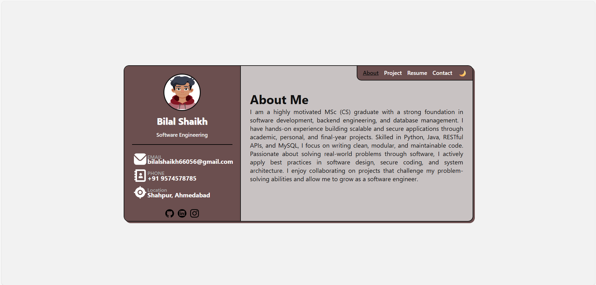
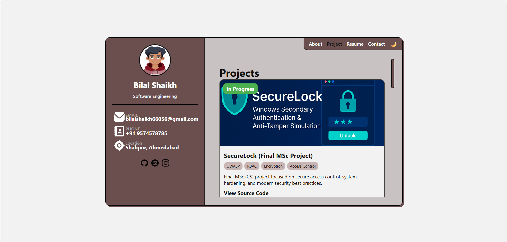
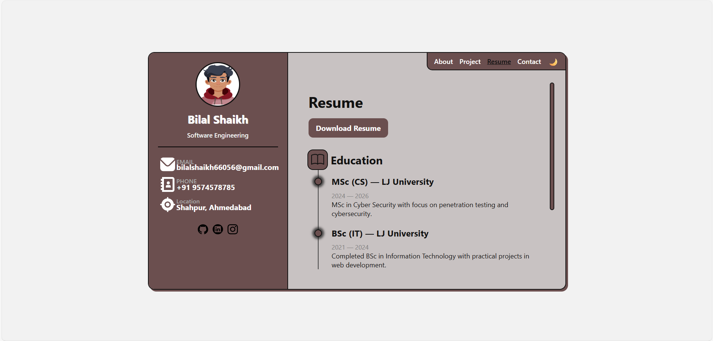
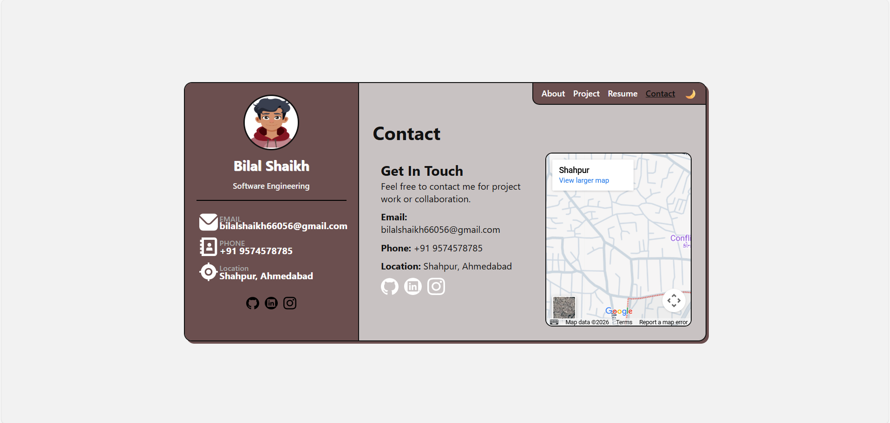

# Personal Portfolio

## Demo






## Prerequisites

Before you begin, ensure you have met the following requirements:

- [Git](https://git-scm.com/install/) must be installed on your operating system.
- [VS Code](https://code.visualstudio.com/download) must be installed on your operating system.

## Installing

To install portfolio, follow these steps:

```bash
git clone https://github.com/bilalshaikh-code/Portfolio.git
```

## Author

- Bilal Shaikh
- GitHub:- [bilalshaikh-code](https://github.com/bilalshaikh-code)
